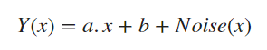
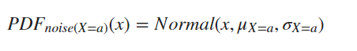
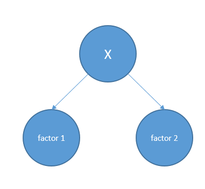
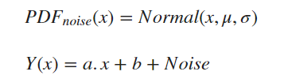
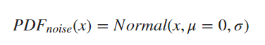
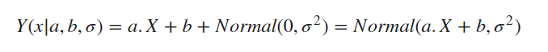
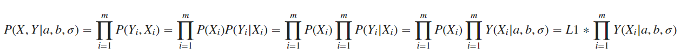
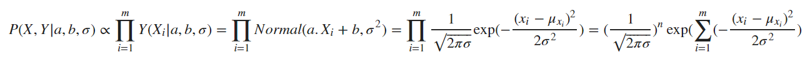
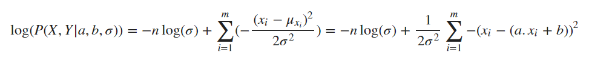

# Why Mean Squared Error? 
For me, a question arises when people use **MSE** as a objective function for their learning tasks. The question is: **WHY??** But if you ask this question you probably get answers such as: 
1. Since it works well on this dataset!
2. Because we want to give more penalty for bad predictions (in comparision with l1-norm)
3. Computating the derivation of MSE is simple (in comparision with l1-norm)  

These reasons do not convince me. For the first reason we can say: "ok! It works well but maybe there are some better choices." For the second and third reasons we can say: "there is other alternative for giving penalty for bad predictions (such as l-4) with easy computations."   
But fortunately I found one reason (for particular situation) in Wasserman's "All of statistics" that makes me a little calmer! For other students not interested in the above reasons, I want to share this post to hopefully help them to be calmer.  
The book states that in linear regression with normal noise if we want to use Maximum Likelihood to learn parameter, it is the same as minimizing the MSE.  
First, let's define linear regression. 

## Definition of Random Variables
Suppose for each data, we have n-dimensional vector X and label Y. We assume that there is a linear relationship between X and Y. (ie. a.X+b=Y) thus we want to find the best condidate for (a,b). But the problem is that there are some unknown factors affecting the Y. We call them noise.  
We can rewrite the equation:
 

There are different ways to find (a,b). In one way, we can think about (a,b) as random variables and we want to know which setting of (a,b) is the most likely one. 
We also have to consider the noise as a random variable so we have to assign a distribution for the noise. We can imagine there are k independent unknown factors with different unkown distribution affecting culmunatively the Y. Because there are a lot of different small factors (k > 30), there is a more general theorem than Central Limit Theorem which states that:
> No matter if series of factor has the same distribution or not, (when our factors are small enough and have some specific properties) the distribution of their sum converges in distribution to **Normal distribution**.     

So when we have  X = a  ,our noise has the distribution like this: 

Here we suppose that in each point X=a, there are k independent factors. Now there is a question:  
Have these k independent factors different distribution in different Xs? Is the noise independent of the X or not?  
I think we should think about Noise independent of X and I would present a reason here. 

#### My Reason
Suppose the knowing X=a is determinor of the distribution of each of the noises, so we have a probabilistic graphical model like this:

Having this model, factor1 and factor2 are dependent to each other. Because knowing factor1 can draw information about X and by having information about X, we would have information about factor2. But this contradicts with our independency assumption. 

So we can rewrite it: 

Since there is a constant factor in the equation (b), without loss of generality, we can suppose the Normal Distribution has the mean equal to ZERO. 

Now, we want to find the most probable $ (a,b,\sigma)$ . 

Now the probablity of Y is as follows:

For finding the most probable configuration, we Use Maximum Likelihood Estimation. 

## Maximum Likelihood Estimation
Maximum likelihood estimation is a method used for finding most likely parameters setting that can generate samples data. If we have m samples $(X_i, Y_i)$, and parameter $a, b $ then, we can to calculate the probability of observation of data: 

We want to find $ (a,b,\sigma)$ that maximize the above probability. Since L1 is is not a function of $ (a,b,\sigma)$  our parameteres, we ommit it and maximize the remaining part.

Logarithm Function is increasing in ${\rm I\!R^+}$ so we can maximize $log( P (X,Y|a,b, \sigma))$ instead. (It is easier for calculating)

As we can see, for every $\sigma$, the maximum value of the above equation happens when the MSE is minimized.  
So we can say this is one reason why it is meaningful to use MSE in a lot of different applications. At least when we want to use a linear regression model.

# Conclusion
Here we tried to represent a reason why it is meaningful to use MSE in one specific task using probabilistic view.  
We can conclude that, MSE is important because Central Limit Theorem is talking about normal distribution and normal distriution is a distribution in which points with less quadratic distance are more probable.  
